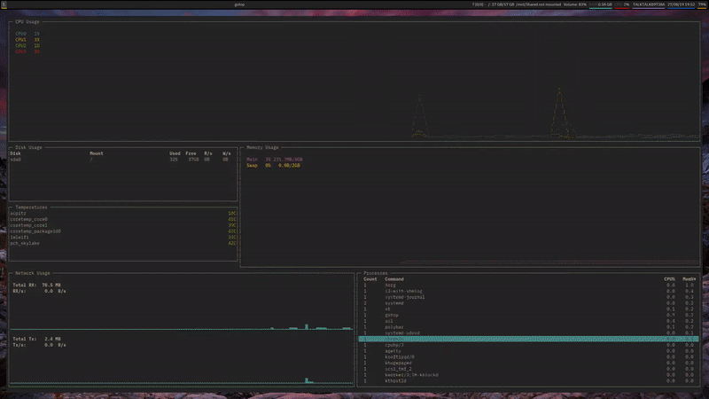

# asl
## The Auto Screen-lapse Tool

### Introduction

asl is a resource-inexpensive way to create timelapses from your screen. It takes screenshots at intervals (`asl`) and uses ffmpeg to convert them into a video (`asl-timelapse`), optionally archiving them

### Installation

Just `pip install asl_screenlapse`

### How to use

Daemonization is flexible. Run `asl` at bootup, with DE Autostart, WM config, systemd service, etc. It will take screenshots in `$HOME/asl-scrots` at intervals, but if more than a certain time passes between them (i.e. different boot), it will create a new numbered folder. 

Whenever you want, run `asl-timelapse` to create timelapses in `$HOME/asl-summaries`, named according to folder number and in the WEBM format.

### Example output

See also `asl-example.webm`

### Todo

 - [X] Install scripts
 - [ ] Configuration in .ini format
 - [X] Make it available on the PyPI
 - [X] Cross platform - using ffmpeg bindings rather than `os.system()`
 - [ ] AUR Package
 - [ ] Automatic archive zipping 
 - [ ] Timelapse from archive

## License
